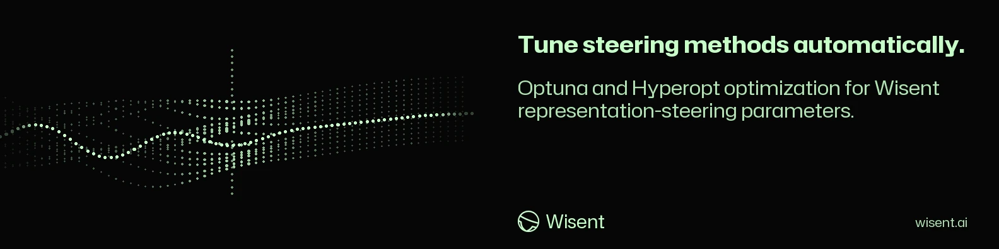

<!-- wisent-banner:start -->
<p align="center">
  
</p>
<!-- wisent-banner:end -->

<!-- wisent-readme-signals:start -->
[](https://github.com/wisent-ai/wisent-optimizer) [](https://github.com/wisent-ai/wisent-optimizer/issues) [](https://wisent.ai) [](https://discord.gg/qRjpkthq54) [](https://www.linkedin.com/company/wisent-ai/) [](https://x.com/wisentai) [](https://calendly.com/lbartoszcze)
<!-- wisent-readme-signals:end -->

# wisent-optimizer

Hyperparameter optimization for wisent steering methods, using Optuna and hyperopt.
Split out of wisent-open-source. Provides `wisent.core.control.steering_optimizer`.

## Install

```
pip install wisent-optimizer
```

## Versioning

The public contract of this package is what it promises callers: the names its package
initialisers re-export, and the `optimization_type` strings `run_steering_optimization`
dispatches on. `scripts/surface.py` prints that surface by reading the source with
`ast` -- never by importing it, so the answer does not depend on having `optuna`,
`hyperopt` or the sibling `wisent` distributions installed.

`released-surface.json` is the same surface recovered from the artifact PyPI actually
serves for the latest published version. Regenerate it with
`python3 scripts/baseline.py` after a release; never edit it by hand, because every
version decision is measured against it.

CI compares the two with the shared fleet rule
([AutoVersion](https://github.com/lbartoszcze/AutoVersion)) and refuses a change whose
declared version disagrees with what it did to the contract. Removing an export or
renaming a dispatch string is breaking; the dispatch strings are in the contract
precisely because an unrecognised one returns `{"error": ...}` instead of raising, so
renaming one breaks callers silently.