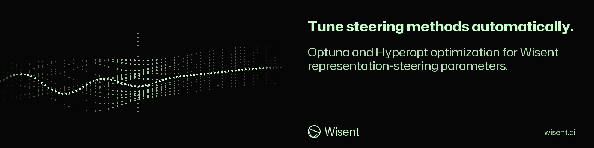

<!-- wisent-banner:start -->
<p align="center">
  
</p>
<!-- wisent-banner:end -->

<!-- wisent-readme-signals:start -->
[](https://github.com/wisent-ai/wisent-optimizer) [](https://github.com/wisent-ai/wisent-optimizer/issues) [](https://wisent.com) [](https://discord.gg/qRjpkthq54) [](https://www.linkedin.com/company/wisent-ai/) [](https://x.com/wisentai) [](https://calendly.com/lbartoszcze)
<!-- wisent-readme-signals:end -->

# wisent-optimizer

wisent-optimizer chose how to steer a model: which method, which layer and how
strong. That search is now [Ster](https://ster.wisent.com/docs)'s, Wisent's
representation-engineering toolkit, and this repository no longer ships code.
The Python package is retired under the zero-Python rule; its last release
stays on PyPI as it was published, and nothing new is released from here.

Each thing the package did has a Ster command, and every number the search
depends on is one you state — Ster assumes no split, strength, batch or
sequence limit, and a measurement it cannot take is reported as missing rather
than as a zero:

| The package | Ster |
| --- | --- |
| `optimization_type: method_comparison`, `layer` | `ster optimize --holdout <FRACTION>`: fits every method at every layer on part of the pairs, ranks them on the rest, publishes the whole table and writes the winner |
| `optimization_type: strength` | `ster evaluate --strengths <S,S,...> --batch-size <N> --max-sequence <TOKENS>`: measures the artifact at each strength by how it moves the model's log-probability of each pair's positive side against its negative side, and picks one |
| `optimization_type: comprehensive` | the two above, in that order |
| `train_recommended_method`, `run_grid_search` | `ster train --method caa\|pca\|logistic --layers <LAYERS>` |
| `get_optimal_steering_params` | the artifact `ster optimize` writes, read with `ster inspect` |

## Quickstart

Install Ster (`stado product install ster --surface cli`, or `cargo install
--path .` in its repository), then choose a method, a layer and a strength on
the example pairs Ster ships, with the toy model it writes:

```bash
ster toy-model toy-model
ster optimize --model toy-model --pairs docs/examples/pairs.json --holdout 0.25 --output calm.ster.json
ster evaluate --model toy-model --pairs docs/examples/pairs.json --vector calm.ster.json \
  --strengths -1,0.5,1,2,4 --batch-size 4 --max-sequence 256
ster generate --model toy-model --vector calm.ster.json --strength <the selected_strength> \
  --prompt "describe the sea ." --max-new-tokens 16 --temperature 0 --seed 7
```

On a real model, name it with `--model` (a Hugging Face id or a local
directory) and use your own pair set; `ster pairs import` reads the common
benchmark formats. The [steering guide](https://ster.wisent.com/docs) explains
each command's report and refusals.
